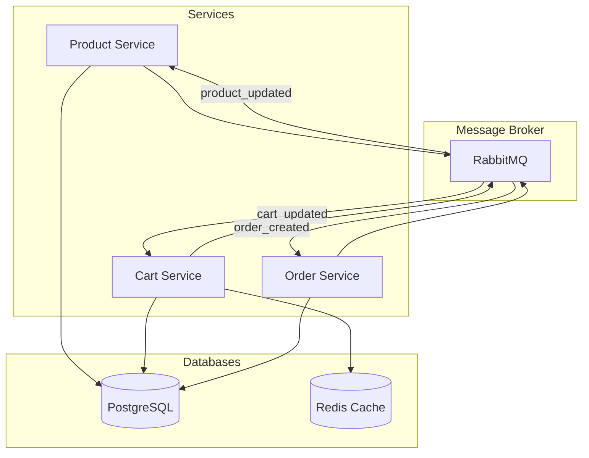

# E-Commerce Microservices

A robust, Docker-containerized e-commerce platform built with .NET 8.0, featuring three scalable microservices (Cart, Product, and Order) interconnected through RabbitMQ message queues, utilizing PostgreSQL for persistent storage and Redis for high-performance caching.



## Microservices

### 1. Cart Service
- Port: 5000
- Databases: PostgreSQL and Redis
- Core Functions:
  - Add product to cart
  - Remove product from cart
  - View cart contents
  - Fast access with Redis caching

### 2. Product Service
- Port: 5001
- Database: PostgreSQL
- Core Functions:
  - Add product
  - Update product
  - Delete product
  - List products

### 3. Order Service
- Port: 5002
- Database: PostgreSQL
- Core Functions:
  - Create order
  - Update order status
  - List orders
  - View order details

## Technologies

- **.NET 8.0**: Main development platform
- **PostgreSQL**: Primary database
- **Redis**: NoSQL database used for caching
- **RabbitMQ**: Message broker for inter-service communication
- **Docker**: Containerization and deployment
- **Docker Compose**: Multi-container management
- **Swagger**: API documentation

## Getting Started

### Prerequisites

- Docker Desktop
- .NET 8.0 SDK
- Git

### Installation

1. Clone the project:
```bash
git clone <repository-url>
cd <project-folder>
```

2. Start Docker Desktop

3. Start the services:
```bash
docker-compose up -d
```

### API Endpoints

After starting the services, you can access Swagger documentation at the following URLs:

- Cart Service: http://localhost:5000/swagger
- Product Service: http://localhost:5001/swagger
- Order Service: http://localhost:5002/swagger

### Management Interfaces

- **RabbitMQ Management UI**: http://localhost:15672
  - Username: guest
  - Password: guest


## Database Schema

Each service manages its own database:
- `cartdb`: Cart information
- `productdb`: Product information
- `orderdb`: Order information

## Message Queues

Main queues used in RabbitMQ:
- `cart_updated`: When cart is updated
- `order_created`: When new order is created
- `product_updated`: When product stock status changes

## Contributing

1. Fork this repository
2. Create your feature branch (`git checkout -b feature/amazing-feature`)
3. Commit your changes (`git commit -m 'Add some amazing feature'`)
4. Push to the branch (`git push origin feature/amazing-feature`)
5. Create a Pull Request

## License

This project is licensed under the MIT License - see the [LICENSE](LICENSE) file for details. 
